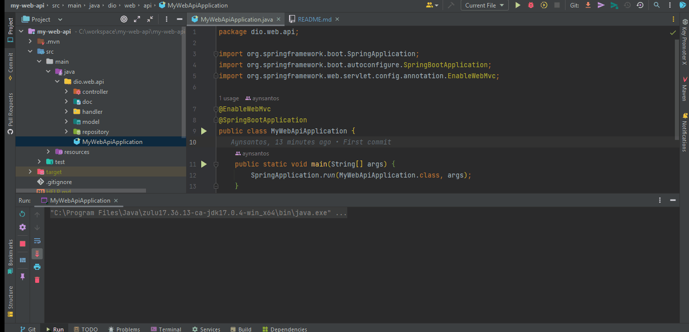

# Criando uma API REST documentada com Spring Web e Swagger

## Features:

- [x] Criação de um projeto `WEB`. 
- [x] Estruturação do `CONTROLLERS`. 
- [x] Documentando API com `SWAGGER` . 
- [x] Habilitado o tratamento de exceções `Exception Handlers`. 
- [x] Interação da API via `Postman`.

---
<h1 align="center">
   
</h1>

---